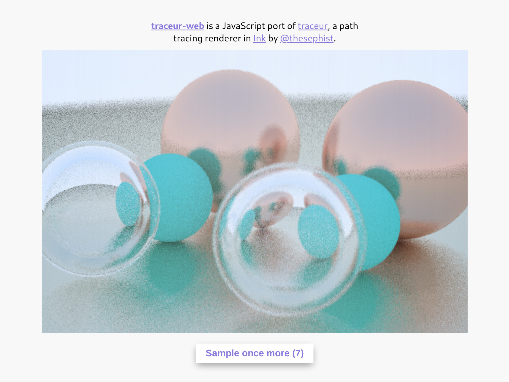

# traceur-web

**traceur-web** is a JavaScript and HTML Canvas port of [traceur](https://github.com/thesephist/traceur), a path tracing renderer in [Ink](https://github.com/thesephist/ink). You can reference the main traceur repository for more context about the project and its implementation.

You can try traceur-web live at [traceur-web.thesephist.repl.co](https://traceur-web.thesephist.repl.co/). Each button click tells the renderer to sample once more at each pixel.

